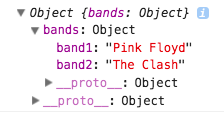

## Bind and Invoke, Fun with Functions

  In JavaScript you have learned much about functions and a ton of crazy things that functions are able to do. One of the more important roles functions play is the ability to bind one function to another function and invoke (or call) that function indirectly. We can also use the binding properties of functions to bind JSON data to a function and invoke it as well. This is one of the primary means of handling JSON data.

### Cool, but how do we bind JSON data to a function?
  In order to make all of this possible we will need to look at the `stringify`, `bind`, and `parse` methods in JavaScript. The first step we need to accomplish is to take our JSON object and make it into a JavaScript string that can be read as key value pairs in a format JavaScript can understand. We can use `JSON.stringify()` and pass our JSON data into the function as an argument as seen below. Let's pretend we just downloaded some band data from a cool band API and we wanted to store it in a variable that we could play with...

#### Stringify

```js
  var jsonObject = JSON.stringify({"bands" : {"band1": "Pink Floyd","band2":"The Clash"}})

  console.log(jsonObject);
  //output => {"bands":{"band1":"Pink Floyd","band2":"The Clash"}}   (this is a string... don't believe me?)

  console.log(typeof jsonObject);
  //output => string
```
So what we see above is that we took a JSON object and used the `stringify` function to turn that object into a readable string that we can then parse through later on.

To further our understanding, let's create a random function that is **not** invoked that will return a piece of data from the JSON object. We'll come back to this a bit *later*.

```js
function doThing(){
  return this.bands.band2;
}
```

#### Bind & Parse

The next step is two-fold. We first want to `bind` our `doThing` function to the definition of another variable. This will allow us to invoke `doThing` without ever actually calling it directly. The second thing we want to do is to `parse` through our `jsonObject` string to be able to sort through the key value pairs and pass the correct info into our `doThing` function. The `parse` method is kind of like the fairy godmother in "Pinocchio". It takes in a string in JSON format (like a wooden puppet) and magically turns it into the real object we can work with in JavaScript ("I'm a real boy!").

```js
console.log(JSON.parse(jsonObject));
//output => ***see picture below***  
```
The output from the above `console.log` is this :


As you can see we have now created an object! Magic!

Now let's focus on binding our `doThing()` function to a new function, so we can secretly call it without ever directly calling it.

```js
var doThingJson = doThing.bind(JSON.parse(jsonObject));

console.log(doThingJson());
//output => "The Clash"
```
Wait, what!? You mean that we actually got `doThing()` to run by doing that? You bet! By using the `bind` method, we tied the `doThings()` "functionality" to the new function `doThingJson()`. By invoking `doThingJson()` inside of our `console.log` statement, and passing it the object we created using the `JSON.parse()` method, `doThing` was invoked behind the scenes and able to return the data it was looking for from an object with the matching key value pairs.

### Conclusion

* JSON data can be saved into a variable and stored as a string by using the `JSON.stringify()` method.
* We can convert that string into a JavaScript object by using the `JSON.parse()` method.
* This allows us to manipulate the data as we would any other object.
* We can use the `bind()` method to bind one functions functionality to another function.
* We can indirectly invoke a function (A) by calling function (B) if (A) is bound to (B). Like `doThing()` was bound to `doThingJson()`.
* When binding a function, we get access to the amazing `this` in the function being bound.


#### References

[MDN Function.prototype.bind()](https://developer.mozilla.org/en-US/docs/Web/JavaScript/Reference/Global_Objects/Function/bind)
