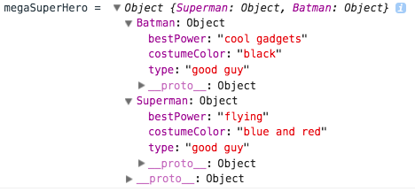

## Merging Objects in ES2015 using `Object.assign()`

There may come a time where you need to merge two objects together to create a super object. You can't just add an object to another object the way you might do simple math addition. Objects by nature are designed to be complex and mimic data as true to the real world as possible. In ES2015, `Object.assign()` gives us the means to group two or more objects together into a superhero object.

### Protecting the originals...
  Using `Object.assign` can be dangerous and gives you the ability to override other the original objects if you are not careful with your syntax. `Object.assign()` takes in arguments, the first of which should be a new empty object in which the combined existing objects will be **assigned** to. Let's take a look...

```js
  var superMan = {
    "Superman" : {
      type: "good guy",
      bestPower: "flying",
      costumeColor: "blue and red"
    }
  }

  var batMan = {
    "Batman" : {
      type: "good guy",
      bestPower: "cool gadgets",
      costumeColor: "black"
    }
  }

  // if we wanted to assign these two superheroes to a new mega superhero object, we can!

  var megaSuperHero = Object.assign({}, superMan, batMan);

  console.log("megaSuperHero = ", megaSuperHero);
  //output => megaSuperHero =  Object {Superman: Object, Batman: Object}
```

Here's what that would really look like in a console:



So... let's discuss what happened. We created two objects, `superMan` and `batMan`, and we wanted to team them up to be an unstoppable force - `megaSuperHero`. Well, quite simply we called `Object.assign({}, superMan, batMan)` and voila `megaSuperHero` was really thing.

  It's *important* to note.. we like Superman, we don't want anything bad to happen to him, so our first argument needs to be an empty object `{}`. Whatever object sits in the first argument position will become the holding tank for other objects being combined. If you want your original object to stay intact, then you must first pass an empty object.

Let's see what happened if we didn't pass an empty object.

```js
var megaSuperHero = Object.assign(superMan, batMan);

console.log("superMan = ", superMan);
//output => superMan =  Object {Superman: Object, Batman: Object}
```

We effectively did what Lex Luther couldn't and scrambled Superman's DNA.. he is now some weird entity that fused with Batman forever! Oh the humanity!

Let this be a lesson and don't forget to give `Object.assign()` an empty `{}` to combine everything in, or you too could ruin Superman forever.


### Conclusion
* In JavaScript, we may come across the need to combine objects, such as JSON data or JavaScript objects. We can do so very easily with the `Object.assign()` method.

* `Object.assign` takes at least two arguments, the first of which will be changed by combining all other objects into it.

* To prevent damaging our original objects, we assign the first argument as an empty object `{}`, and then pass in the other arguments to be combined afterwards.
* The merging of two or more objects creates a larger object that houses all of the properties and values from the original objects passed into it.
#### References

* [Object.assign MDN](https://developer.mozilla.org/en-US/docs/Web/JavaScript/Reference/Global_Objects/Object/assign)
