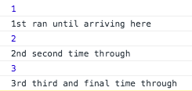
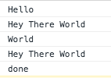

## Deeper Understanding of Generator Functions

We've given a broad overview of generator functions, but let's take a look at the pieces that make generator functions do what they do and explain how they work a bit more in depth. We will describe the importance of the function*, yield, next(), and yield* keywords and how they work to help us create our function.

### Declaring a generator function...

The use of the `function*` keyword allows us to declare a generator function and separates it apart from the ordinary JavaScript functions we are accustomed to.

We've taken a look at this already, but let's see it again, because the more times we examine our material and see it used the more tools we will have for understanding it.

```js
function* myGenFunc(x) {
  console.log(x);
  yield "ran until arriving here";
  console.log(x+1);
  yield "second time through";
  console.log(x+2);
  yield "third and final time through"
}

const gen = myGenFunc(1);

console.log("1st", gen.next().value);
//logs value of x = 1, then runs yield and logs "1st" followed by value of yield "ran until arriving here"

console.log("2nd", gen.next().value);
//logs value of x + 1 = 2, then runs yield and logs "2nd" followed by value of yield "second time through"

console.log("3rd", gen.next().value);
//logs value of x + 2 = 3, then runs yield and logs "3rd" followed by value of yield "third and final time through"

console.log(gen.next().value); //returns undefined because all yields have been run.
```
Here's the actual console (not showing the undefined in this case)..



**It should also be noted that we could declare our `myGenFunc` by doing the following:**

```js

//applying the Asterix to the function name instead of function word still achieves the same result.
function *myGenFunc() {
  //yields etc...
}
```


The important take away is that when we first declare our generator function, whether it be `function* myGenFunc` or `function *myGenFunc`, we still need to instantiate it. We do this by declaring another variable (in the case above `const gen`) and setting it equal to the generator function. We can pass the generator function a parameter when we instantiate it, as we did in the above example by passing `myGenFunc(1)`.

#### Yield to the results...

Inside of our generator function is where the important stuff happens, and it's critical that we know what is going on. Using the example from above let's look at our code line by line.

```js
function* myGenFunc(x) {
  //the code inside of here will run until the first yield statement runs. So anything above the first yield statement will execute
  //on the first next() call.
  console.log(x);
  //our yield statement tells our application to jump out of this function, remember where it was at, and be ready for another call to run the next yield statement.
  yield "I was the first yield, I ran after running console.log(x); ";

  //now when we call next again, we will run all of the code until the next yield statement.
  //in this case simply logging the value of x+1 and then the second yield statement.
  console.log(x + 1);
  yield "I ran second, after running the log statement: x+1 ";

  //and so on and so forth until all yield statements are completed, or we use a return to stop the process
}

```

So we can see that ALL of the code between each yield statement will run. Our first run of the function will execute all lines of code until it meets the first yield statement. In this case it is simply `console.log(x)`. It then reaches the yield statement and returns the yield object that has a value of `"I was the first yield, I ran after running console.log(x); "` and a done property that is set to `false`. We can extract that value alone when we get to our instantiation and running of the next() function later on.

As we looked at previously, we can also pass along another generator function using the `yield*` keyword. This allows us to jump inside of another function and run it's yield commands until completion, at which point we would return to our initial generator function and finish any remaining yield statement. Let's see it again!

```js
function* genTwo(x) {
  console.log("World");
  yield x;
}

function* genOne(x) {
  console.log("Hello");
  yield x;
  yield* genTwo(x);
  yield "done";
}


const gen = genOne("Hey There World");

console.log(gen.next().value);
console.log(gen.next().value);
console.log(gen.next().value);
```

Which would render this in the console:




#### "Instantiate" it...
We know that we aren't dealing with a true constructor function, but we do still need to instantiate our generator function so we can use it. This is simply done by creating a variable and setting it equal to the generator function. We do this above with the following code: `const gen= genOne("Hey There World");`.

#### Next() up...
The last part is the next part. That is to say, the next function gives us the ability to cycle through our yield statements one by one each time we call next. In the example above we wanted to console.log the value, so we wrapped the important part in a console.log statement... but the real take away is what happened inside.

When we call our function `gen` and attach the `.next()` we run our function up to the first yield statement. If we did not use the `.value` then we would be returning the yield object which would contain: `{ value: "some value", done: boolean }`. The value would be whatever we return from the yield and the done property is set to true or false depending on if there are more yield statements to be run. When our generator function has iterated through all possible yields, then the done property is set to `true` and our function will no longer run.

### Conclusion
* We use `function*` or `function *nameOfFunction` to declare a new generator function.
* Inside of our generator function, we use `yield` to provide stopping points while running our code. We will run everything above each yield statement and then the yield statement itself before exiting the function and waiting for the next call.
* We instantiate our generator function by creating a new variable equal to the generator function we declared.
* We use `next()` to cycle through each yield statement until the yield object returns a done property of `true`, at which point we exit the function and any further running of the function returns undefined.

#### References
* [MDN](https://developer.mozilla.org/en-US/docs/Web/JavaScript/Reference/Statements/function*)
