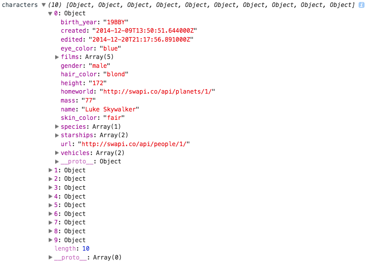
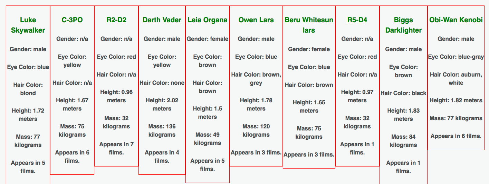

## Fetching JSON and Fun Things to do with it
We have really begun to see the extent with which a React application can start to manage our data and render our application accordingly. One of things we have not looked at just yet, is pulling that data in from an outside source using `fetch()` and what we can do with that data after we retrieve it.

Let's examine the flow of things in a simple application designed to list some of the characters from the *Star Wars* movie series. We will do so by using fetch to get the data from the *Star Wars* API ([https://swapi.co/](https://swapi.co/)). We will then look at the means in which we store that data and then apply it our app.

### Fetching the Data
By now you should be comfortable with using `fetch` and promises such as `then` to retrieve our data. Let's set up our first component.

```js
export default class App extends Component {
  constructor(props) {
    super(props);

    this.state = {
      characters: [],
    }
  }
  componentDidMount() {
    fetch('http://swapi.co/api/people/')
    .then(results => results.json())
    .then(responseData => {
      this.setState({characters: responseData.results});
    })
    .catch((error) => {
      console.log("Error with Fetching : ", error);
    });

  }
  render() {
    console.log("characters", this.state.characters);
    return (
      <div className="main">
        <CharacterList people={this.state.characters}/>
      </div>
    );
  }
}
```

* The top portion of this should be pretty familiar by now, inside of our `constructor`, we are setting the `state` and giving it a property `characters` that is initially set to an empty array.
* The next method we see is the `componentDidMount()` method. This method is the preferred method to use when retrieving data with a network request.
* This method is invoked immediately after the component is mounted on the DOM, so it assures us our data will have a place to live.
* We then begin our network request using the `fetch()` method. We pass `fetch` the URI of our API (the specific point at which we wish to retrieve our data)... in this case `fetch('http://swapi.co/api/people/')`.
* We then need to initiate and chain together our methods to return a Promise. We can use the `.then()` method to chain together our Promises and complete our request only after the entire cycle of our request is complete.

#### A Closer Look

```js
fetch('http://swapi.co/api/people/')
.then(results => results.json())
.then(responseData => {
  this.setState({characters: responseData.results});
})
.catch((error) => {
  console.log("Error with Fetching : ", error);
});
```

* After we call `fetch`, we call our first `.then` method: `.then(results => results.json())` .
* This first method says that after the request has gone through successfully then run a callback function (in which we pass in the `results` parameter and return those results as a JSON object using the `json()` method.
* We then call another `.then` method: `.then(responseData => {this.setState({characters: responseData.results});})` .
* This second `then` method makes sure that we received our Promise and data from the first `.then`.
* When that Promise is achieved, we take the `responseData` and we set the `state` of our `characters` array to the `responseData.results`.
* We use `.results` because we researched our API and saw the object returned from the API had a "results" property in which our data was store.
* We use the `this.setState({characters: responseData.results})` to achieve this.
* The last link of the chained methods is optional. We call the `.catch` method at the very end.
* `.catch` takes a function that is passed the parameter of error. It listens for any error messages from the server and allows us to do something with them should they occur.
* In this case we made a simple `console.log` statement to write the error to the console.

### What we do with our data...
In this case, we have set our `state` with the data we pulled in. We now could use that data to render part of this component or a child component. To keep our learning sharp, we are going to pass our data to our child component.

We do this when we give the child component an attribute of `people`.
* `<CharacterList people={this.state.characters}/>` inside of our `<App />`'s `render` method.
* We pass the state of our `characters` array down to the child component `<CharacterList />`.

#### Now let's look at the child component

```js
class CharacterList extends Component {
  constructor(props) {
    super(props);

  }
  render() {
    let peeps = this.props.people.map((person, index) => {
      return (
        <li key={index} className="personList">
          <div className="persona">
            <h4 className="name">{person.name}</h4>
            <h5 className="gender">Gender: {person.gender}</h5>
            <h5 className="eyes">Eye Color: {person.eye_color}</h5>
            <h5>Hair Color: {person.hair_color}</h5>
            <h5>Height: {parseInt(person.height) / 100} meters</h5>
            <h5>Mass: {person.mass} kilograms</h5>
            <h5>Appears in {person.films.length} films.</h5>
          </div>
        </li>
      )
    })
    return (
      <div className="characters">
        <ul className="character-ul">
          {peeps}
        </ul>
      </div>
    )
  }
}
```
This should all look pretty familiar from here on out, but a quick recap of what's going doesn't hurt.
* We set up our component with a `constructor` method with `super` inside of the method. This allows us to receive `props`.
* Inside of our `render` method we declare a variable `peeps` using the the ES2015 `let` syntax.
* Our `peeps` variable is a mapping of `this.props.people` which we passed down from our parent components state.
* When we `.map()` over each item in the array we grab each `person` from that array.
* We create a `return` statement in the `map` function that returns a `<li>` with a `key` value equal to the `index` so that each list item has a unique identifier and React can render them and keep track of them in the virtual DOM.
* We then extract the properties we which to list by calling each attribute from our `person` object, such as `person.name` or `person.eye_color`.
* We can get these values by examining our `console.log` statement inside of the `render()` method that we used for reference in our parent component...

```js
render() {
    console.log("characters", this.state.characters);
    return (
      <div className="main">
        <CharacterList people={this.state.characters}/>
      </div>
    );
  }
```

* That console.log() statement returns something we can drill into and examine the data with...



We are pretty much all set and just have to let this bad boy run to see what we get from this point. With an exceptionally awkward amount of lame styling, our final output looks something like this:




### Conclusion
* We can use the `fetch` method in React in order to make a network request.
* We use `.then` to manage our Promises and make sure our network request is completed.
* We can use `.catch` to listen for error messages from the network and utilize them for functionality in our program, or simply for reference.
* We can store our data in `state`, using `setState()` inside of our Promises.
* `componentDidMount` is the ideal method in which to make network requests.
* `state` can be passed down as `props` to children components.


#### References
* [MDN Then Promises](https://developer.mozilla.org/en-US/docs/Web/JavaScript/Reference/Global_Objects/Promise/then)
* [MDN Body.json()](https://developer.mozilla.org/en-US/docs/Web/JavaScript/Reference/Global_Objects/Promise/then)
* [MDN Using Fetch](https://developer.mozilla.org/en-US/docs/Web/API/Fetch_API/Using_Fetch)
* [StarWars API : SWAPI](https://swapi.co/)
* [React Component Lifecycles](https://facebook.github.io/react/docs/react-component.html#componentwillreceiveprops)
