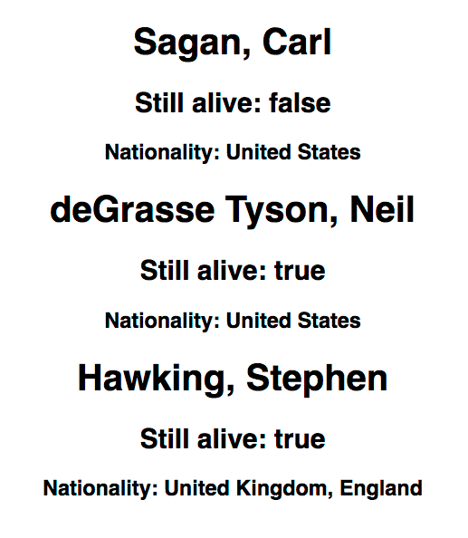

## Iteration in React
A huge part of React stems from the way that it handles data and re-renders the page according to that data. React components can have components that render data and elements after iterating over that data. One of the more common ways you will see this is using Arrays.

### Map It!
Let's pretend we have a **very** simple application that we can examine this process on. This application takes in an array of objects, and renders each object into it's own `<div>` on our website.

Alright, so we have this cool array of famous astrophysicists...

```js
let famousAstroPhysicists = [
  {
    id: 1,
    firstName: "Carl",
    lastName: "Sagan",
    alive: "false",
    nationality: "United States",

  },
  {
    id: 2,
    firstName: "Neil",
    lastName: "deGrasse Tyson",
    alive: "true",
    nationality: "United States",
  },
  {
    id: 3,
    firstName: "Stephen",
    lastName: "Hawking",
    alive: "true",
    nationality: "United Kingdom, England",
  },

];
```

We will pass that array into our `<App />` component. Using the map function we can then render individual `<div>` tags for each of our objects in the array... So let's look at how this would look in the App.js file and then break down what happened.

```js
import React, { Component } from 'react';
import logo from './logo.svg';
import './App.css';

let famousAstroPhysicists = [
  {
    id: 1,
    firstName: "Carl",
    lastName: "Sagan",
    alive: "false",
    nationality: "United States",

  },
  {
    id: 2,
    firstName: "Neil",
    lastName: "deGrasse Tyson",
    alive: "true",
    nationality: "United States",
  },
  {
    id: 3,
    firstName: "Stephen",
    lastName: "Hawking",
    alive: "true",
    nationality: "United Kingdom, England",
  },

];


export default class App extends Component {
  render() {
    let famedPhysicists = famousAstroPhysicists.map((physicist) => {
      return (
        <div key={physicist.id} >
          <h1>{physicist.lastName + ", " + physicist.firstName}</h1>
          <h2>Still alive: {physicist.alive}</h2>
          <h3>Nationality: {physicist.nationality}</h3>
        </div>
      )
    });
    return (
      <div className="App">
        {famedPhysicists}
      </div>
    );
  }
}

```
* Inside of our App Component, just after our render method, but *before* our return statement, we create a new variable `famedPhysicists` using the ES2015 `let` syntax (which takes place of the `var` keyword).
* `famedPhysicists` takes the array from the top of our page `famousAstroPhysicists` and maps over it, returning the `physicist` from each iteration of the function.
* We then jump into a return statement (for the map function) and we return a `<div>` with an **EXTREMELY** important attribute called `key`. In this example we assign `<div key=physicist.id>`.
* The `key` attribute is what allows our React application to keep track of each newly created element against the real DOM. It allows for proper re-rendering from cues in the virtual DOM. The `physicist.id` simply grabs the "id" attribute from each object that is mapped over, in this case, just "1, 2, and 3".
* After we create a new div, we continue using brackets anywhere we want to assign a JavaScript value. We create the last name, first name `<h1>` by using the `{physicist.lastName + ", " + physicist.firstName}`.
* We continue doing this for whatever data we would like to extract from each object and organize it however we please.
* In the return statement for `<App />` component we then simply use bracket notation `{}` and put our variable name (the mapped array `famedPhysicists`) - like so:

```js
return (
  <div className="App">
    {famedPhysicists}
  </div>
);
```

The resulting product is pretty amazing, React renders each scientist in it's own `<div>` on our page!



### Conclusion
* React is able to `map` over arrays and render elements for each part of the array we wish to include.
* The `key` attribute is the means that React uses to keep track of each rendered element when mapping over an array.
* The `key` attribute is extremely import and React would not be able to monitor changes to the DOM properly without it.
* Iterations in React can also be commonly seen using `<ul>`, `<ol>`, and `<li>` elements.
* JavaScript is placed within `{}` when using JSX.
* The return statement from our map function can still only return one container.
* The variable in which the map function was stored can then be used to render inside of the return statement for the component. i.e. (`{famedPhysicists}`)
