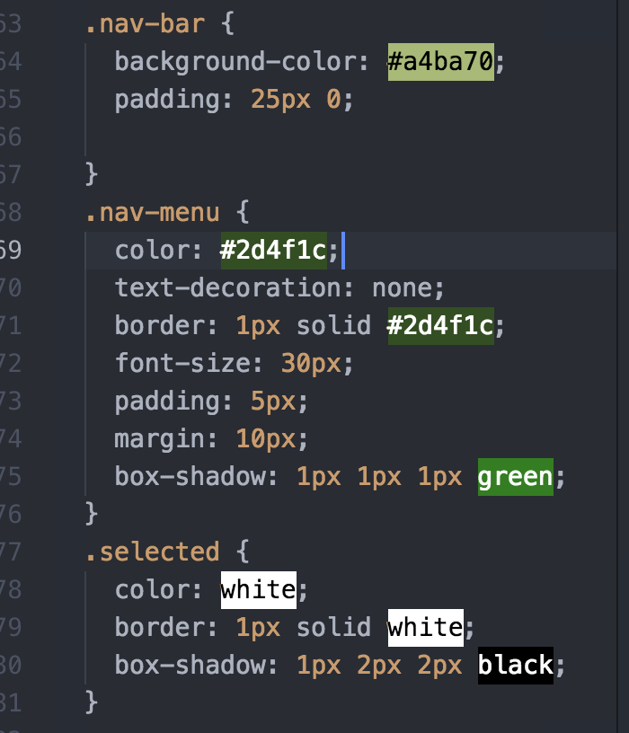
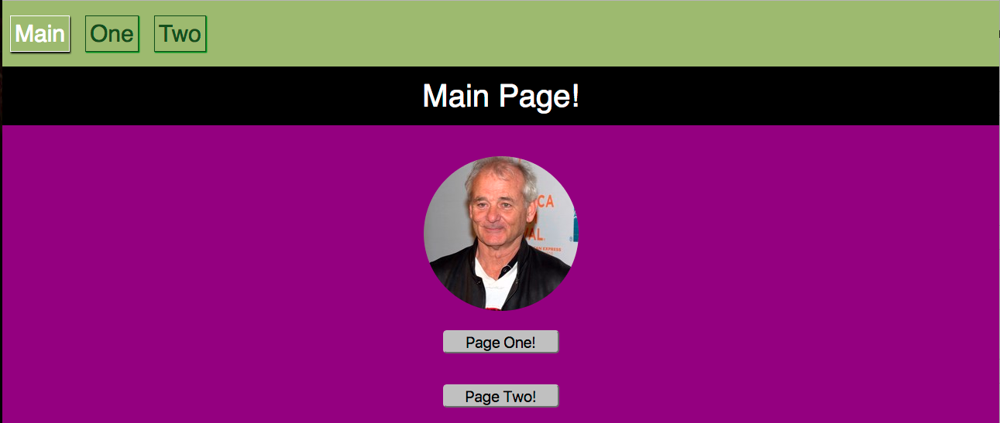

## Active Navigation Links with React Router
React Router gives us a lot of really helpful tools, and by now you should be chomping at the bit with excitement and wonder for all of the ways we can apply these wonderful additions. Just like some infomercial tagline of old "But wait, there's MORE!" - React Router has even more to offer us. We are going to examine the concept of active navigation links and how we can style them in React Router easily and efficiently using `<NavLink>` components.

### The NavLink component.
In the following basic example, we are going to create a very simple "SPA" that will have a very minimal navigation bar. This navigation bar will be present on all of our pages (because we want it to be) and should help direct us to the other portions of our application while also signaling what current page we are on.

#### The set up...
Looking inside of our index.js file, we are going to see that really not much more work was required for this addition to our project. We simply can add `NavLink` to our list of imported components from `react-router-dom`. We then will call that component to create a Navigation Bar style element that has some really cool attributes available to use. Let's look below:

```js
//########### index.js ##############
import registerServiceWorker from './registerServiceWorker';

//import React
import React from 'react';
import ReactDOM from 'react-dom';

//import Styles
import './styles/index.css';

//import React Router
import {BrowserRouter, Route, Switch, NavLink} from 'react-router-dom';

//import Components
import App from './scripts/components/App';
import PageOne from './scripts/components/page_one';
import PageTwo from './scripts/components/page_two';

ReactDOM.render(
  <BrowserRouter>
    <div>
      <div className="nav-bar">
        <NavLink activeClassName="selected" className="nav-menu" exact to="/">Main</NavLink>
        <NavLink activeClassName="selected" className="nav-menu" to="/page_one">One</NavLink>
        <NavLink activeClassName="selected" className="nav-menu" to="/page_two">Two</NavLink>
      </div>

      <Switch>
        <Route path="/page_one" component={PageOne} />
        <Route path="/page_two" component={PageTwo} />
        <Route path="/" component={App}/>
      </Switch>
    </div>
  </BrowserRouter>

  ,
  document.getElementById('root'));
registerServiceWorker();
```

It's *important* to note that inside of our `<BrowserRouter>` we are still limited to return one child element, as we are inside of any of our component render methods. So in order to make this style of code valid, we must wrap both our `<NavLink>` and `<Switch>` components in an outside `<div>`.

We will come back to this later on, and look at refactoring the `NavLink` component filled Navigation Bar and making it a stand alone component that can be reused wherever we see fit. But first let's just get a good overhead view of what is going on.

Inside of our `<div className="nav-bar">` we have passed several `<NavLink>` components. Each <NavLink> component has a few baked in attributes that we are able to call upon to make our life easier.

We won't use all of these for this example, but here are the attributes that `<NavLink>` has:
* `activeClassName: [[takes a string " " as value]]` - the activeClassName will check against the url in the browser and when it matches it will add on a special class name that you define (a common one would be "selected" or "active"). This allows us to set a CSS style for the active class, which will allow us to easily see what link is active compared to the others.

* `activeStyle: [[ takes an object { } as a value ]]` - the activeStyle attribute will take an object {} filled with style key value pairs. For instance if we wanted our active link to change font color and background color we would pass activeStyle an object like so:

```js
<NavLink
  activeStyle={{
    color: "blue",
    backgroundColor: "white"
  }}>Main Page</NavLink>
```
* `exact` is a boolean value that we have seen before. The `exact` keyword is placed before the `to=` path declaration. This means that in order for any of the other attributes to be true, the path URL must match exactly to the `to=` attribute.


```js
<NavLink activeClassName="selected" className="nav-menu" exact to="/">Main</NavLink>
```

The above snippet would mean that if, and ONLY if the path was just "/" would any of the attributes work.

* `strict` can be used to make sure that each path has a trailing "/": for instance - `/home/`. We wont dive much deeper into this right now, but know that it exists and would take the place of `exact` in terms of placement in the `<NavLink>`.

```js
<NavLink activeClassName="selected" className="nav-menu" strict to="/home/">Main</NavLink>
```

* Lastly, we have the `isActive: [[takes a function as a value]]`. This will take a take a function that is used only if you want to do more than verify that the link's pathname matches the URL's pathname. You could for instance only want a link to be active if an id number was odd, or some other similar scenario.

#### NavLink `activeClassName`
The `activeClassName` attribute gives us the JavaScript logic needed to check if our link is active without having to write utility functions to determine where we are in our app. This is a HUGE time saver and makes our app even more efficient with out having to write extra code for styling. We simply add a class (in this example we will use "`selected`") and give a path to match against (i.e. `to="/page_one"`). And then either use `activeStyle` or just plain CSS to add some styling. For this example, we will just use CSS, so let's take a peek inside of the CSS style sheet to see what we have going on.



So we can see readily that we have a normal (non-active) class called `nav-menu` which has default styling for our links in the `nav-bar` class. Then we add styling for the class `selected` which differs from the default and allows the link to the page we are on to stand out from the others. This is very helpful for the user experience and ease of navigation.

Let's take a peek at what this would look like on the when we were on the main page. We would expect our `NavLink` to take on the characteristics of the `selected` class and appear white, while the others remained green.



And it works! Amazingly simple solution for our navigation needs.

### Pulling it all together
We discussed earlier that we probably should pull the NavLinks into their own component for efficiency purposes and to make them a stand alone component. So let's clean up our code a little. First let's create a new component called `NavBar` in a new file `nav.js`.

```js
//############## nav.js ################
import React, { Component } from 'react';

import { NavLink } from 'react-router-dom';

export default class NavBar extends Component {
  render() {
    return (
      <div>
        <div className="nav-bar">
          <NavLink activeClassName="selected" className="nav-menu" exact to="/">Main</NavLink>
          <NavLink activeClassName="selected" className="nav-menu" to="/page_one">One</NavLink>
          <NavLink activeClassName="selected" className="nav-menu" to="/page_two">Two</NavLink>
        </div>
        {this.props.children}
      </div>

    )
  }
}

```

To do this we simply extracted our `NavLinks` from the `index.js` file and put them into their own component. Now we can export and import this component to any other component we wish. We use `{this.props.children}` to allow this component to render all of the other components inside of it when they are called.

It probably makes the most sense to render this component inside of our `index.js` because we want this to appear on every page of our app. We could handle that by importing to each of our components but that would not be DRY programming.

So let's take a look back at our refactored `index.js` page now. (*Feel free to scroll back up and look at what it looked like before the refactor to compare*).

```js
import registerServiceWorker from './registerServiceWorker';

//import React
import React from 'react';
import ReactDOM from 'react-dom';

//import Styles
import './styles/index.css';

//import React Router
import {BrowserRouter, Route, Switch, NavLink} from 'react-router-dom';

//import Components
import App from './scripts/components/App';
import PageOne from './scripts/components/page_one';
import PageTwo from './scripts/components/page_two';
import NavBar from './scripts/components/nav';

ReactDOM.render(
  <BrowserRouter>
    <NavBar>
      <Switch>
        <Route path="/page_one" component={PageOne} />
        <Route path="/page_two" component={PageTwo} />
        <Route path="/" component={App}/>
      </Switch>
    </NavBar>
  </BrowserRouter>

  ,
  document.getElementById('root'));
registerServiceWorker();

```

Pretty straightforward - we add the `<NavBar>` components to our lists of imports and then we use the opening and closing `<NavBar></NavBar>` tags to wrap our `<Switch>` component. `<NavBar>` knows to expect child components because we passed it `{this.props.children}` inside of it's opening and closing tags in the `nav.js` file. This is a nice and tidy solution for our simple app and demonstrates the capabilities of the `<NavLink>` component and the efficient means with which we are able to style our active links.

### Let's see it in action...

**INSERT VIDEO HERE FROM URL (http://screencast-o-matic.com/watch/cbhwlNXmyy) or mp4 file (./NavLink.mp4)**


### Conclusion
* We can use the `NavLink` component from `react-router-dom` to have access to styling attributes for active links in our navigation bar.
* Active links help display the current page a user is on by differentiating the active link from the other links in the navigation bar.
* `<NavLink>` comes with some key attributes, the most commonly used are the `isActive` and `activeClassName`.
  * `activeStyle` takes an object with our styling wishes as a normal React element would recieve.
  * `activeClassName` is a class that gets added on to the components classes when the link matches the pathname for the URL.
* We can use `exact` to ensure the pathname matches exactly to our URL (usually needed for our index route ("/")).

#### References
* [React Training](https://reacttraining.com/react-router/web/api/NavLink/isActive-func)
