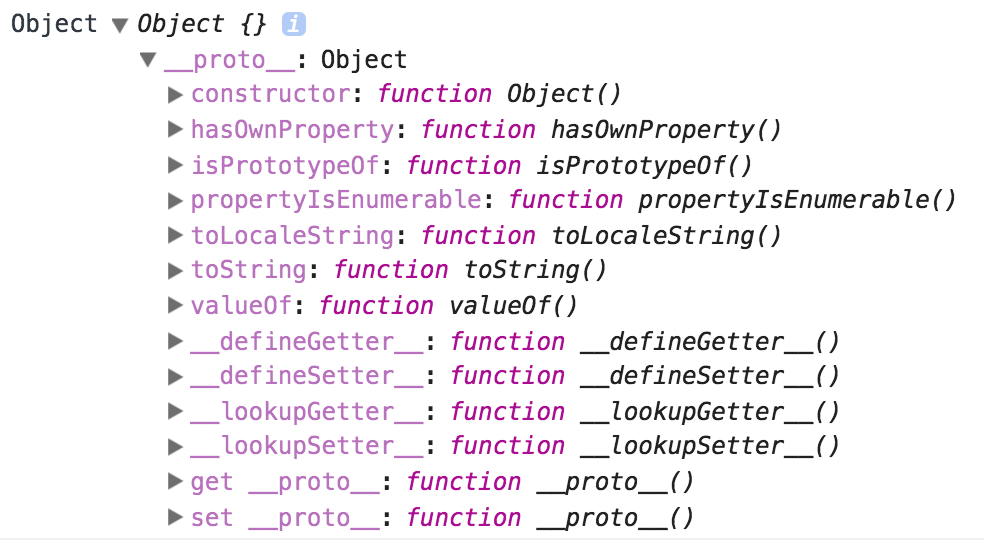

## Prototypal Inheritance
Prototypal Inheritance, sometimes referred to as Prototype-based Inheritance or Delegation, is a very powerful tool in JavaScript. It allows JavaScript functions (in the form of functions, arrays, or most commonly objects) to pass properties and methods down to other functions using prototypes.

### How does inheritance work?
Think of the food chain you may have learned about in Biology class. Sitting at the very top of the chain is the `Object.prototype`. All inheritance starts here and trickles down the prototype chain to each child given access to that chain.

#### What is a prototype?
A prototype in JavaScript begins when any new function is created. JavaScript has a built in Object constructor that by default passes its prototypes to any new functions.

If you were to do the following, you can see what JavaScript has pre-baked into its Object constructor.
```js
console.log(Object());
```
The above snippet would render a breakdown of the available properties and methods on the JavaScript Object.



* One of the things that you can see above is that every object has the ability to be a constructor as mentioned in our lesson on Constructors. That ability is because of prototypal inheritance.


### How do prototypes work?
A fundamental property of objects in JavaScript is that they are mutable. More simply put, they can be changed.
This plays an important role in prototypal inheritance.

It begins with a prototype object that is an **object** designed with a specific set of properties and methods available to it.

Because of the mutability of objects and the ability for any function (object) to be a constructor, we can create new instances of the prototype object that carry on the properties of the original object - while still allowing us to add new properties and methods or change and override inherited ones if necessary.

#### Inheritance in Action...
Let's take a look at a constructor function called `Fruit`.
```js
function Fruit() {
  this.sweet = true;
  this.hasSeeds = true;
}
```
We can give `Fruit` properties directly such as a `sweet`, by using `this.sweet = true` as seen above. We also have given it the property and value of `hasSeeds: true` because we are going to create more fruit, and we know that majority of fruit will be sweet and have seeds.

Now let's see how inheritance works. Let's create a few new constructors called `Apple`, `Pear`, and `Grape` that will become a children of the Fruit constructor.
```js
function Apple() {
  this.texture = 'crunchy';
}

function Pear() {
  this.texture = 'weirdly crunchy and soft simultaneously';
}

function Grape() {
  this.hasSeeds = false;
}
```
#### As of right now...
The `Apple`, `Pear`, and `Grape` do not inherit anything from the `Fruit` constructor, so if we were to check to see if the apple was sweet using `console.log(Apple.sweet)`, we would get back `undefined`. To make the apple sweet, we need to set up prototypal inheritance... Using the `new` keyword lets us lock on to the `Fruit()` object and access the `Fruit.prototype` which will link the chain together

```js
Apple.prototype = new Fruit();

console.log('Apple.prototype:', Apple.prototype);
// output => 'Apple.prototype: Fruit {sweet: true}'
```
#### So what happened?
The `Fruit` constructor passed it's properties down the prototypal chain to the new instance `Apple`. This is why `console.log` returns `Fruit` and it's properties.

But it doesn't end there, remember those freebie prototypes from the JavaScript Object? Well let's look below... we have not defined a `valueOf()` method anywhere, and yet if were to run the following code, you can see the output below gives us a value! COOL, that's inheritance at work again!
```js
console.log(Apple.prototype.valueOf());
// output => Fruit {sweet: true}
```

#### One step further...
Prototypal chains can continue even further - let's look at the following:
```js
var apple = new Apple();
var pear = new Pear();
var grape = new Grape();

console.log('apple.texture:', apple.texture);
//output => 'apple.texture: crunchy'
console.log('pear.texture:', pear.texture);
//output => 'pear.texture: weirdly crunchy and soft simultaneously'
console.log('grape.hasSeeds:', grape.hasSeeds);
//output => 'grape.hasSeeds: false'
console.log('apple.sweet', apple.sweet);
//output => 'apple.sweet: true'
```
The reason that `apple` is crunchy *stems* from the fact that it inherited crunchy from the `Apple` constructor when the `var apple = new Apple();` was instantiated. However, it would have been impossible without prototypal inheritance for `apple` to also be sweet without the declaration of `Apple.prototype = new Fruit();`.

 We can also learned that properties and methods can be overridden, so we see that `grape` returns `false` for the `hasSeeds` property because we gave the `Grape` constructor a property of being seedless.

 #### Is that the only way? Nope!

 Another example of inheritance can be demonstrated by using the `Object.create()` method. `Object.create()` get's passed an object as reference and creates a new object that inherits directly from the object it was passed in as an argument. The other main difference is you can not pass `null` into the `Object.create()` function and still return an object linked to the `Object.prototype`. Let's take a look at a variable named `parent` with a function `sayName` and see how it can be passed down to it's child (a variable name `child`) and used by the child variable.

 ```js
 var parent = {
   sayName: function() {
     console.log('Hey my name is ' + this.name);
   },
   name: 'ParentPerson'
 }

 var child = Object.create(parent);
 child.name = "ChildPerson";

 //Because of inheritance . . .
 child.sayName();
 //console.log output => "ChildPerson"
 ```
 #### What's really happening here?
 Behind the scenes when the `child.sayName()` is invoked, the `child` object is first examined for the `sayName()` function, when the function is not found there, JavaScript searches up the prototypal chain and the next stop is the `parent` object, at which point `sayName()` is found. `sayName()` then runs on the child element, using the name property from the `child` object where it was called.

 Interestingly, you can see the prototype chain being travelled in the following example as the `sayName()` method travels up the chain in search of a name value. Since `grandChild` does not posses a `name:` property, it goes up the chain until it finds one, which happens to be from the `child` object.
 ```js

 var grandChild = Object.create(child);

 grandChild.sayName();
 //output => "ChildPerson"

 ```

#### Let's see it out in the wild...
Below is the code from above in runnable examples. Take a few minutes to run the code and play around with prototypal inheritance.
```js runnable
function Fruit() {
  this.sweet = true;
  this.hasSeeds = true;
}

function Apple() {
  this.texture = 'crunchy';
}

function Pear() {
  this.texture = 'weirdly crunchy and soft simultaneously';
}

function Grape() {
  this.hasSeeds = false;
}

Apple.prototype = new Fruit();

console.log('Apple.prototype:', Apple.prototype);

console.log(Apple.prototype.valueOf());

var apple = new Apple();
var pear = new Pear();
var grape = new Grape();

console.log('apple.texture:', apple.texture);
console.log('pear.texture:', pear.texture);
console.log('grape.hasSeeds:', grape.hasSeeds);
console.log('apple.sweet', apple.sweet);

```

#### And here is the example using `Object.create()`, test the waters and see what happens with `null` being passed in to the function too.

```js runnable

var parent = {
  sayName: function() {
    console.log('Hey my name is ' + this.name);
  },
  name: 'ParentPerson'
}

var child = Object.create(parent);
child.name = "ChildPerson";

child.sayName();

var grandChild = Object.create(child);

grandChild.sayName();

```
### Conclusion
  * We learned that properties and methods can be passed down the prototype chain and inherited by their children functions.
  * We know that you can override inheritance when it is necessary to do so, allowing us to blanket much of an objects properties with generalized statements, but make them more specific when needed.
  * Inheritance allows us to program in a 'DRY' method, and saves us from repeated tons of code by rewriting object and object with the same properties.
  * The prototype chain searches locally on a function and then moves up the chain looking for matching prototype data.


#### References
  [Object Playground](http://www.objectplayground.com/)

  [Crockford's JavaScript](http://javascript.crockford.com/prototypal.html)

  [Stack Overflow Discussion](http://stackoverflow.com/questions/4166616/understanding-the-difference-between-object-create-and-new-somefunction)
