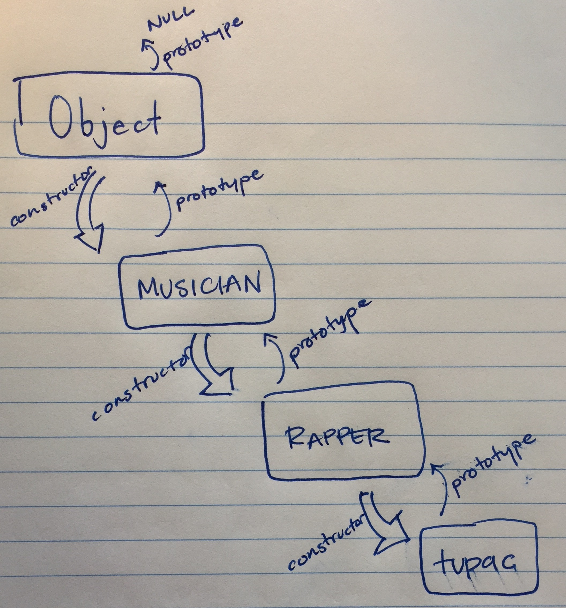

## Workin' on the Prototype Chain

We've already taken a pretty deep look at the means and benefits of prototypal inheritance. Well all of those goodies are possible because of prototype chain. As a recap and another look at the prototype chain, let's examine it in it's entirety.

### Follow the prototype

Every object in JavaScript has a prototype. It receives a prototype when it is created thanks to the `Object` object (that carries with it all the magic and mystery, methods and properties, that make objects so powerful).
When executing code, the search begins with the most local object in question, and then proceeds to that object's prototype, and so on ...

### Who's the top dog of the prototype chain?

At the very end of the chain, the top dog of them all, is `Object`. As children, parents, and the JavaScript `Object` transfer data along the prototype chain, `null` provides the stopping point. `Null` is by default without prototype and the how the traversal up the chain is stopped.

#### Prototype chains can go on as long as you desire...

They really can go for a long time, but it is not considered best practice to create a chain that is too long. As length of the chain increases, maintainability decreases.

#### Picture it:


#### Another look ...

Let's imagine we have a constructor class `Musician`.

```js
  class Musician {
    constructor() {
      this.makesMusic = true;
    }
  }

  class Rapper extends Musician {
    constructor(makesMusic) {
      super(makesMusic)
      this.hasTightBeats = true;
      this.hasDeepLyrics = true;
    }
  }

  var tupac = new Rapper();

  tupac.isAlive = false;
  tupac.oneOfTheGreats = true;

  console.log(tupac);
  //output => {makesMusic: true, hasTightBeats: true, hasDeepLyrics: true, isAlive: false, oneOfTheGreats: true}
  console.log(Musician.isPrototypeOf(Rapper));
  //output => true
  console.log(tupac.makesMusic);
  //output => true
  console.log("2pac is a : ", Object.getPrototypeOf(tupac));
  //output => "2pac is a : Musician {constructor: function}"

```

* So what can we get from the above code? First we can see that `tupac` inherited the `makesMusic` property from the `Musician` class.

* We can see that `tupac` also inherited `hasTightBeats` and `hasDeepLyrics` from the `Rapper` class.

* We can also see that `Musician` is a prototype of `Rapper` in the `console.log` statement that evaluated to `true`.

* Lastly, we can use the `Object.getPrototypeOf(tupac)` to find out what the prototype of `tupac` is, which goes all the way up of the chain until it reaches the `Musician` constructor that started it all.

### Conclusion

* The main take away is that inheritance begins with the top rung of the ladder, on which sits the `Object` object
in JavaScript.

* Every object created inherits basic properties and methods from the `Object` through the prototype chain.

* Parent constructors pass methods and properties via inheritance to their children.

* When searching a child for a particular property or method, the search begins with the child, then works it's way up all the way until it reads `null` from the `Object.prototype`, at which point a search is stopped.

#### References

- [MDN](https://developer.mozilla.org/en-US/docs/Web/JavaScript/Inheritance_and_the_prototype_chain)
- [A Plain English Guide to JavaScript Prototypes](http://sporto.github.io/blog/2013/02/22/a-plain-english-guide-to-javascript-prototypes/)
