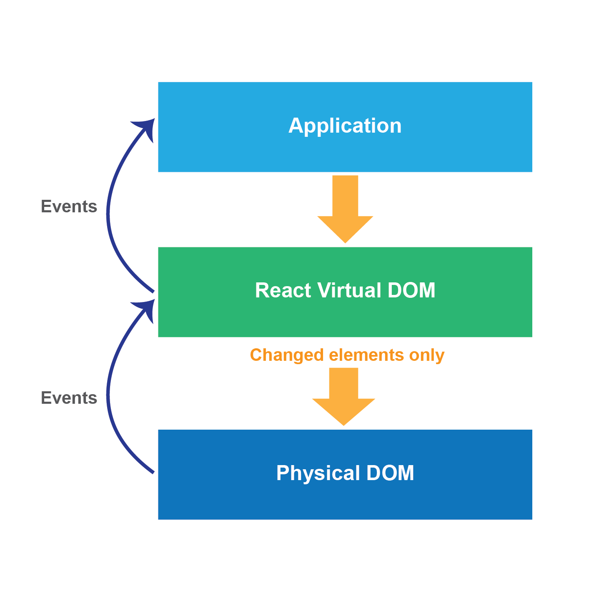

## Lifecycle of a React component

As you have been learning, in React you use **components** to organize everything that needs to be displayed. React's primary difference over other frameworks is that the architecture is designed to re-render the entirety of the application any time any state changes. This is similar to doing a full page refresh. Because the components are constantly being re-rendered, there will be times when you want to do something before or after the component has rendered, or may want to avoid a re-render. This is where the component *lifecycle* comes into play. The **component lifecycle** describes the process of stages that every React component goes through. To understand these stages you first to need understand the way React renders with a **virtual DOM**.

### React DOM

React creates a **virtual DOM** by abstracting the **application DOM** and maintaining it in memory. React uses this Virtual DOM to handle in-page interactions and updates from the server. With that input, React then compares the *new state* of the Virtual DOM with the *previous state* of the Virtual DOM and updates the **physical DOM** with the changed elements. So the physical DOM always reflects the up-to-date application state.

### Component Lifecycle Methods

In order to have more control over the stages the component is going through, React provides *methods* that denote when the different stages occur. These are called **component lifecycle methods** and proceed in a certain order. There are three major phases that the stages go through: mounting, updating and unmounting.

#### Mounting

When the component is created (initialized) and then inserted into the DOM.
- `constructor`
  - called before the component is mounted. This is the place to initialize state and bind methods.
- `componentWillMount`
  - invoked immediately before mounting occurs (before render).  
- `render`
  - the `render` method is required on a component, and it must return a *single React element* (either a native DOM component `
` or composite component you have defined). The `render` method should not modify the state.
- `componentDidMount`
  - invoked immediately after a component is mounted.

#### Updating

A component is re-rendered because a props or state change occurs.
- `componentWillReceiveProps`
  - invoked before a mounted component receives new props. Use this method if you need to update the state in response to prop changes.
- `shouldComponentUpdate`
  - invoked before rendering, when new props or state are being received. This method allows your component to exit the lifecycle and avoid unnecessary re-rendering. Useful when only a small amount of data has changed, if there is no update the component and all of its children will break from the lifecyle and the most recent virtual DOM from this component downward will persist.
- `componentWillUpdate`
  - invoked immediately before rendering when new props or state are being received
- `render`
- `componentDidUpdate`
  - invoked immediately after updating occurs

#### Unmounting

Component is removed from the DOM.
- `componentWillUnmount`
  - invoked immediately before a component is unmounted and destroyed

#### Other methods

`setState`  
- this is the primary method used to update the user interface in response to event handlers and server responses. `setState` causes the component and its children to be re-rendered. Note that changing state using `setState` is asynchronous, so it does not always immediately update the component.

`forceUpdate`
- will cause the component to re-render. Use if your `render` method depends on other data and you want to force this component to render. You should try to avoid using this method.

### Conclusion

The component lifecycle allows us to exert control over the way React applies updates to the DOM. Data flows downward, from parent component to its children. The three main stages of the lifecycle process are mounting, updating, and unmounting. The virtual DOM is re-rendered any time there is an update, but only with the changed elements. We have touched on props and state here, but will delve deeper into the differences in the next lesson.

#### References/Resources

[React Lifecycle](https://facebook.github.io/react/docs/react-component.html)

[React cheatsheet](https://reactcheatsheet.com/)

[React lifecycle cheatsheet](https://gist.github.com/monicao/243958d7498ed9fabe78)
