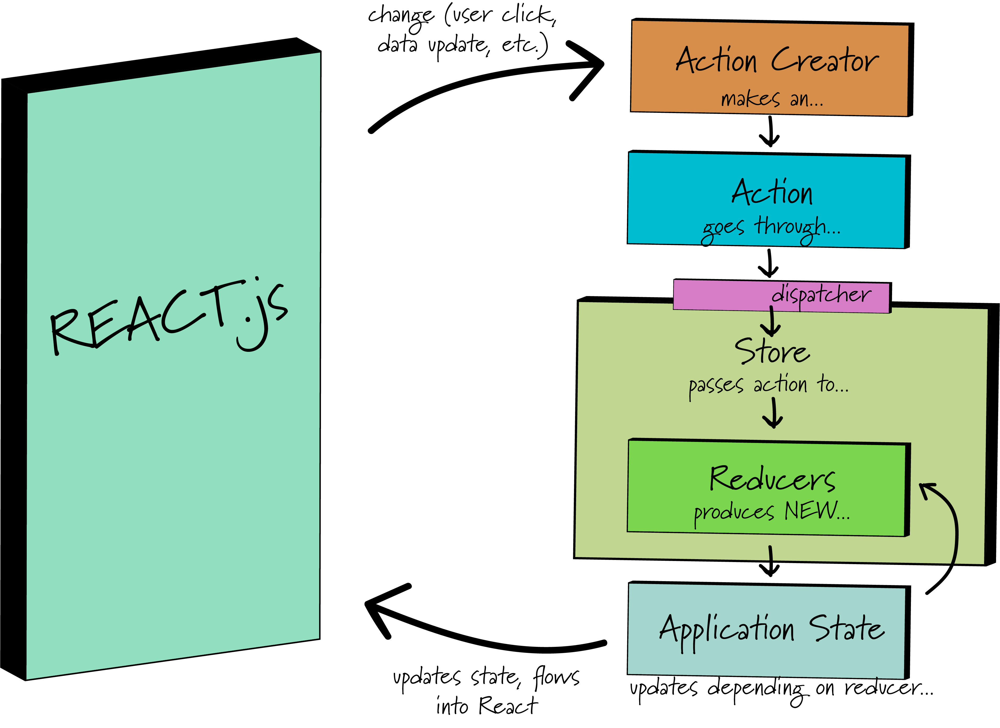

## The Redux Saga...
One of the main topics we have yet to hit on is a pretty important part of our Redux workflow. If you'll recall from a few lessons back when we first were introduced to our good friend redux, we spent some time talking about the cycle of data and the workflow of our application. We even had a nifty little diagram that showed how the cycle worked. Don't remember because you've been cramming so much information into your heads? Have no fear, we will show it again right now.

So here is what we went over previously:



We watched the user create some event that triggered our action creator to pass its action to our dispatcher inside of our store. The dispatcher then delegated the action to the reducers, and the matching reducer then created a new updated state depending on what the action needed. Pretty simple, hopefully!

Well, there is more to the puzzle than we led on at first. In Redux we have the ability to create functions that can do things for us in workflow cycle. Introducing, new to the show, Middleware.

### I've heard of the Middle of Nowhere, but what is Middleware?

As simply defined as possible, middleware provides a docking point for third party libraries and code. At the dock they can do something for us and then ship the action out to the reducer. Middleware can be used for logging things, crash reports, talking to/fetching from APIs, routing, and more! A key concept here is that we can use it for asynchronous events (like fetching data) --> that will come in handy in the near future.

So, quick recap, middleware basically intercepts the action from dispatch, does some stuff that we want it to, and sends it off to the reducers. That's the cycle.


### With that in mind...
With the newfound knowledge (albeit very basic) of middleware, let's look at revising our workflow! We've updated our little diagram to reflect middleware and where it fits into the puzzle of Redux (and React).


#### Looking at Middleware: Redux-Saga

We've looked at how middleware fits into the workflow of our redux application, but lets look at a specific type of middleware that will be implementing in the near future. Welcome to the stage, Redux-saga.

Redux-saga is a third party library that is a middleware for our Redux applications. It's most common usage is for making API calls, which will be our primary focus. Redux-saga allows us to make asynchronous functions fit in our workflow and not affect the rest of the workflow cycle. Redux-saga is directed by the actions we create in an application and is able to be started, paused, and cancelled. It receives full access to our application state and there for it can dispatch Redux actions as well.

We can install redux-saga using npm

```
npm install --save redux-saga
```

#### Bring 'em back...
Redux-saga uses generator functions (like we have just been learning about) and unlike some other libraries the generator functions allow us to avoid callback hell and keep our actions pure and maintainable.

#### A brief and simple example:
Okay so let's look at a simple example to get a feel for how this all ties together and demonstrates that pretty diagram from earlier.

Let's suppose that we have an application and we need to fetch some data. We will make a generic recipe holding app that can fetch recipes from our recipe server. For brevity's sake, we will not actually make this functional, just illustrate how the pieces would fit together.

```js
//########### /containers/IngredientComponent.js ##############

class IngredientComponent extends Component {
  //stuff here
  //a clicked button handler that fetches our Ingredient
  handleButtonClick = () => {
    //set our props to the id of the ingredient and our dispatcher
    const { ingredientId, dispatch } = this.props;
    //call inline dispatch *NEW!~ pass action type and payload
    dispatch({type: 'FETCH_INGREDIENT', payload: {ingredientId}});
  }
  //actual component stuff would be below here
}

```

The `IngredientComponent` dispatches an object action to the Store. Just like normal. But now we will create our first Saga. The Saga will watch for the action type we specify (in this case: `FETCH_INGREDIENT`) and trigger our API call to fetch the ingredient data.

```js
//############### /sagas/saga.js  #####################

//we are going to import a few modules from our redux saga library
import { call, put, takeEvery, takeLatest } from 'redux-saga/effects';
import Api from 'someApi.com';

//we must first create a worker. It'll be fired when FETCH_INGREDIENT action occurs.
//it will be a generator function, so we can control it.
//it will also use a try / catch syntax that may be new but we will walk through later.
//just try to catch the bigger picture now.

function* fetchIngredient(action) {
    try {
      const ingredient = yield call(Api.fetchIngredient, action.payload.ingredientId);
      yield put({type: "FETCH_INGREDIENT_SUCCESS", ingredient: ingredient});
    } catch(error) {
      yield put({type: "FETCH_INGREDIENT_FAILURE", message: error.message});
    }
}

//now we need to start our fetchIngredient call on every dispatched "FETCH_INGREDIENT" action.
//because of the generator we can run multiple fetches at a time.
function* mySaga() {
  yield takeEvery("FETCH_INGREDIENT", fetchIngredient);
}

export default mySaga;

```

Now we need to hook the middleware up in our main index.js file.

```js
//############## src/index.js ##################
import React from 'react';
import ReactDOM from 'react-dom';
import registerServiceWorker from './registerServiceWorker';

//import styles
import './styles/index.css';

//import redux middleware support
import { Provider } from 'react-redux';
import { createStore, applyMiddleware } from 'redux';
//import middleware support from redux-saga
import createSagaMiddleware from 'redux-saga';

import reducers from '../reducers/reducers';
import mySaga from '../sagas/saga.js';

//we now create our Saga middleware
const sagaMiddleware = createSagaMiddleware();
//attach this to the Store for access in application

const createStoreWithMiddleware = applyMiddleware(sagaMiddleware)(createStore);

// run the saga middleware
sagaMiddleware.run(mySaga);

ReactDOM.render(
  <Provider store={createStoreWithMiddleware(reducers)}>
    <App />
  </Provider>
  , document.querySelector('.container'));
registerServiceWorker();
```

So with that example we can kind of see how redux-saga fits into the picture. We will go over wiring everything up for real in the next lesson.

### Conclusion
* Redux-saga is a middleware. Middlewares are a docking point for a third-party library to interact with our application.
* Middlewares intercept the action from the action creator, and are able to perform a task before relaying it on to dispatch and to the reducers.
* Redux-saga is especially good at handling asynchronous operations that would otherwise bog down our application state. We commonly will use redux-saga to perform API calls for us.

#### References
* [Redux Saga - Beginner Tutorial](https://github.com/redux-saga/redux-saga/blob/master/docs/introduction/BeginnerTutorial.md)
* [Middleware - Redux](http://redux.js.org/docs/advanced/Middleware.html)
