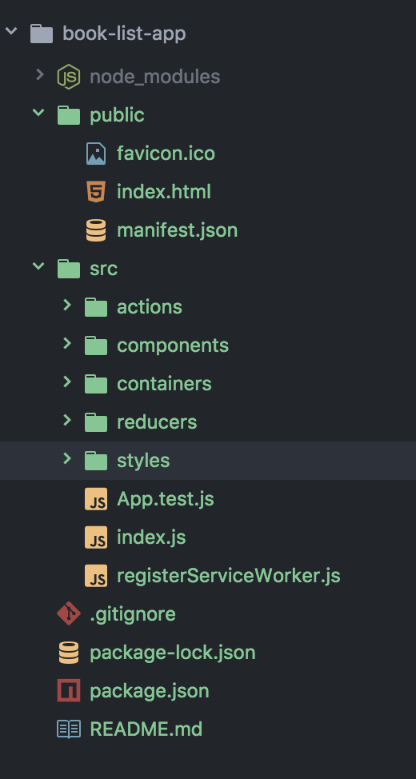
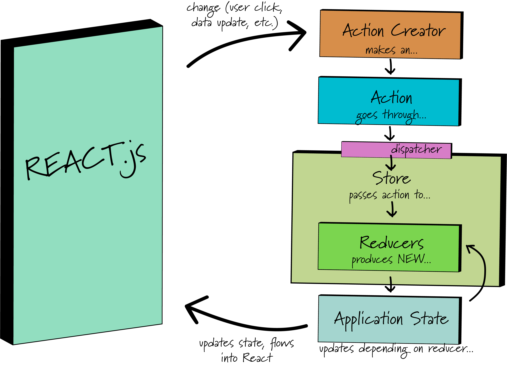

## The Workflow of React and Redux!
So we just discussed application state and what it means to our program and the data within it... and we mentioned that there's this cool thing called Redux that helps with it... but we definitely didn't open the conversation on how it all works. Fear not fellow coders, the time is upon us to learn Redux and the workflow involved with Redux and React when they hold hands and play nicely.

There are a few things we need to discuss before we even get in depth on Redux...

1. Setting up our application file/folder structure in a conventional way for Redux.
1. Downloading and installing the necessary dependencies to use Redux along with React.
1. The pieces of the Redux puzzle and how they work with React workflow.

After we discuss these very important concepts, then we can start to play around with Redux and see it perform in an application.

Without further ado, lets get started!

### Pruning our File Tree for success (a.k.a getting the right folders set up)
For the most part we have been compartmentalizing our various files. By now we should be comfortable with having a styles folder and a scripts folder, as well as a components folder for our React components. Well, that will all stay the same, but we need to let a few more players into the locker room to join the team.

Don't worry about what these things are just yet, we will discuss them in great detail, but just understand that fairly significant changes are going to be made to our file structure.

As mentioned already, the folders we have already been accustomed to using are all going to stay the same, but now we need to add some more housing for our new Redux neighbors.

In addition to our components folder where we keep all of our React components, we will now add these separate folders:

1. containers
1. actions
1. reducers

Our file tree should now look something like this:



We will talk about what they are as we move through the workflow.

#### Files to add
Inside of our *actions* and *reducers* files, we need to add an `index.js` file to each folder. We will discuss what goes on in each of them later on and touch back on the set up and what files to add, but just something to note.

### Install our dependencies

In terminal, we will go into our project directory and use npm to install a few more dependencies for our project. (We should already be up and running with React's dependencies by now.)

```
npm install --save redux

npm install --save react-redux

```

The first npm install will install Redux for us. The second npm install will act as the kindergarten teacher that makes sure React and Redux hold hands while they are walking in line down the hallway. In other words, they are the glue that binds React and Redux together to make them get along nicely.

#### Up Ahead...
There are other additional installs that we will make as we journey through our safari in Redux Land, but for now this will get us started.

### Redux and React Workflow...
For just a moment lets take a step back and look at React as one giant box (with application state, components, component state, etc) - there are tons of things going on inside of this big React box, but for now our primary focus is application state. The state that really drives what our application is all about.

Let's consider in the most simple of terms and most basic of examples a truly simple app. There is some data... and a user clicks on an option which displays details of that data on another screen. (So simple we wouldn't actually need Redux for it, but we will use it to explain anyway). Let's take a snapshot of what happens when that user clicks on the item and flow of events that take place afterwards.

A picture is worth a thousand words, so here's a diagram and we will discuss the individual pieces immediately following it:



Once that click happens, we have wired it up to our application state and it triggers an **Action Creator**.

#### Action Creator
Action Creators are functions that return an **Action**. It's really that simply, they give us the specific "action" for our particular event.

#### Actions
Actions are payloads (like the explosive stuff in a missile or a the luggage being transported in an aircraft). In Redux payload refers to the information that sends data from your application to the **dispatcher**.

#### Dispatcher
The dispatcher acts like an operator at a 911 call center and directs your action payload to the right department (a "reducer"). The dispatcher's "office" so to speak is part of a bigger overall concept called the "store". For now, just now that the dispatcher takes an action and passes it into the **store** and on down to the correct **reducer**.

#### Store
To keep up with our analogy, the dispatcher is sitting in a huge facility that keeps Police, Fire, and Paramedic teams on the ready. We call this facility the "store". It's the location where our dispatcher, our reducers, and some of our application state live. These response teams represent what we call **reducers**.

#### Reducers
Reducers can be numerous, and though for our example we listed "3", there can be more or less of them depending on the application. The important part to know is that they receive the action payload. When they receive the action payload they pair it up with a proper response. If the call from the dispatcher was burglar, then police respond. If the call was fire, the fire team responds, etc.

Actions describe the fact that something happened, but they don't specify how things should change in response.

Reducers take that action and respond with the proper change - which manages **application state** and how it should change.

Reducers are pure functions that pair an action and the application state and returns a new state based on what the action dictated. If there was a fire, the fire team puts out the fire and returns a house that is no longer on fire.

#### Complications of State in Redux
One thing that is of great importance to note is that application state is never mutated. After an action meets the previous state in the reducer a brand new object representing the next state is return. We can't simply alter the existing state (which we will discuss in coming examples).

Reducers functions should also never perform API calls or routing transitions, nor should they use non-pure functions like Date.now() or Math.random() - as these would mutate state.

"Given the same arguments, it should calculate the next state and return it. No surprises. No side effects. No API calls. No mutations. Just a calculation." - Redux docs.

#### Application State
The application state is then updated as a new copy of state with the changes performed by the reducer. This new application state then is pushed back in to our giant shiny React.js box - where React can gain access to it.

Inside of our components we can utilize this state to help re-render and update our application with the newly changed data! The cool thing is that this application state is a big bundle of all of our state which means that we have access to it throughout our entire program should we need it. However, we generally reserve the term **container** for a React component that will be the bridge between Redux and React. These containers contain the application state and determine how it should flow throughout the React.js box.

### Conclusion
* The React / Redux workflow cycle is fairly complicated, but really centers around updating application state.
* Some sort of data change or event triggers an Action creator.
* The Action Creator creates and Action.
* An Action is the payload of information and data regarding what happened.
* A dispatcher handles the Action and directs it to the proper Reducer function inside of our Store.
* The reducer function is a pure function that pairs an action with appropriate piece of application state and updates it accordingly.
* Application state is never mutated, but rather copied and returned as a new object.
* The new application state is sent back to React and utilized by our Container components.
* Container components are the bridge between React and Redux and determine what should be done inside of React with the newly created application state.

#### References
* [Redux Basics](http://redux.js.org/docs/basics/)
* [Redux diagrams GitHub](https://github.com/reactjs/redux/issues/653)
