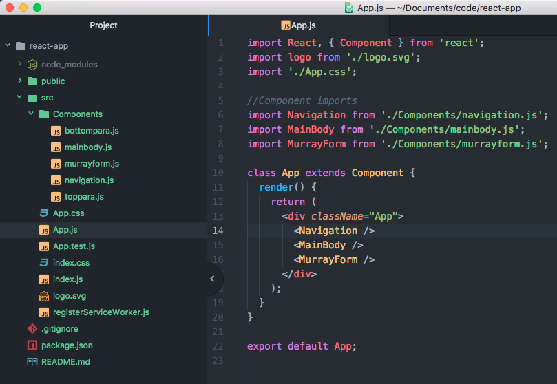

## Nesting Components

We grazed the tip of the iceberg in our introduction to React. We glossed over some huge chunks of information that really give React the power to do what it does. One of the big things that we barely touched on in our intro was Components in React. Let's think back to our Favorite Murray application... instead of writing HTML to display our website, we used JSX in a file called App.js. We exported something called the "App" which was a Component from React and then imported that file into our index.js and then rendered it inside of a `<div id="root">` tag on our HTML page. Well, that component concept is pretty huge in React, and the basis for the way we will organize our code and our applications when developing. Another big take-away is that components can be nested to increase the organization of our application. Let's take a deeper look...

### Components
A component is a chunk of code that is responsible for rendering a specific portion of the UI (user interface). They function a lot like, well, JavaScript functions. They can accept inputs (called "props") and return elements describing what should appear on the screen.

In our App, we had just one component. In an ideal application, components are responsible for independent pieces of code and are often reusable when applicable.

Components can actually be defined as a function :

```js
function Welcome(props) {
  return (
    <h1>Hello, {props.name}</h1>
  );
}
```

The use of `{ }` allows for pure JavaScript to be inserted into the JSX, and in this case assumes that somewhere data with a name property is being passed along.

We can also write Components using the new ES2015 classes, that same function above would now be written as the following :

```js
class Welcome extends Component {
  render() {
    return (
      <h1>Hello, {this.props.name}</h1>
    );
  }
}
```

These two examples are the same essentially, but ES2015 classes give us a bit more functionality that we will visit later.

### Nesting Components - A look at Component hierarchy
We've touched on the fact that our components should really be accountable for unique pieces of the application, but what does that mean?

The first step of building React applications requires looking at the big picture, a wireframe or something along those lines. Let's take a look at the Favorite Murray website again - we are looking only at the most simplistic of ideas to make sure the complicated concept of nesting will hatch some understanding.

```js
class App extends Component {
  render() {
    return (
      <div className="App">
        <nav className="navbar">
          <h1 className="title">Favorite Murray</h1>
        </nav>
        <main className="main-body">
          <div className="top">
            <div className="image-one">
              
            </div>
            <p className="top-paragraph">
              Lorem ipsum dolor sit amet, consectetur adipisicing.
            </p>
          </div>
          <div className="bottom">
            <div className="image-two">
              
            </div>
            <p className="bottom-paragraph">
              Lorem ipsum dolor sit amet, consectetur adipisicing.
            </p>
          </div>
        </main>
        <div className="murrayinator">
          <h3>"What's your favorite Murray Movie?"</h3>
          <form className="murray-form" action="" method="">
            <label htmlFor="murray-movie">Type your favorite movie here...</label>
            <input type="text" id="murray-movie" />
            <button>Submit</button>
          </form>
        </div>
        <div className="answer">
          <h4 className="murray-display"></h4>
        </div>
      </div>
    );
  }
}

export default App;
```

The way to think about Components is to divide your application into pieces - each of which should be responsible for a certain portion of the app and independent of the others. There also will be one main component that will be responsible for all of the other components.

Let's take a look at what would be rendered on the screen from our code above, and then break it in to separate pieces using colored boxes, and a dashed outer line to represent the entire main app component.


* In pink we have highlighted our very simple navigation bar.
* In light blue we highlighted our top `<div>`.
* In purple we highlighted our bottom `<div>`.
* And in orange we highlighted our `<div>` containing our form.
* Around the outside of all it, we have our dashed line. As our application stands right now, we currently are just using that dashed box to render our entire document with the `<App />` component.

So Let's see how we can break these into individual pieces. Let's first create our navigation `<div>`.

#### The Nav
If we want to create a component for our navigation we need to pull it out of the current App div.

Just above the App class, we can create a new class for our navigation.

```js
class Navigation extends Component {
  render() {
    return (
      <nav className="navbar">
        <h1 className="title">Favorite Murray</h1>
      </nav>
    );
  }
}

```

Now back inside of our App component we can **nest** our Navigation component back in...

* Remember all components must return only one container and all tags must be self closing or have a closing tag.

**To save space, let's look at only the portion of code where we would reinsert the Navigation component back into the App**

```js
class App extends Component {
  render() {
    return (
      <div className="App">
        <Navigation /> //added the Navigation component.
        <main className="main-body">
          <div className="top">
            <div className="image-one">
//the rest of the component below...
```

We now have a nested component! The `<Navigation />` component is now nested within our `<App />` component. Super cool, right!?

#### Completing the Nest
Let's finish what we started and take a look at the entire nesting of our application using our picture from earlier. A few slight changes to our `<App />` component will be necessary in order to return all of our components in singular containers.

```js
class Navigation extends Component {
  render() {
    return (
      <nav className="navbar">
        <h1 className="title">Favorite Murray</h1>
      </nav>
    );
  }
}

class TopPara extends Component {
  render() {
    return (
      <div className="top">
        <div className="image-one">
          
        </div>
        <p className="top-paragraph">
          Lorem ipsum dolor sit amet, consectetur adipisicing.
        </p>
      </div>
    );
  }
}

class BottomPara extends Component {
  render() {
    return (
      <div className="bottom">
        <div className="image-two">
          
        </div>
        <p className="bottom-paragraph">
          Lorem ipsum dolor sit amet, consectetur adipisicing.
        </p>
      </div>
    );
  }
}

class MurrayForm extends Component {
  render() {
    return (
      <div className="murrayinator">
        <h3>"What's your favorite Murray Movie?"</h3>
        <form className="murray-form" action="" method="">
          <label htmlFor="murray-movie">Type your favorite movie here...</label>
          <input type="text" id="murray-movie" />
          <button>Submit</button>
        </form>
        <div className="answer">
          <h4 className="murray-display"></h4>
        </div>
      </div>
    );
  }
}

class MainBody extends Component {
  render() {
    return (
      <div className="main-body">
        <TopPara />
        <BottomPara />
      </div>
    );
  }
}

class App extends Component {
  render() {
    return (
      <div className="App">
        <Navigation />
        <MainBody />
        <MurrayForm />
      </div>
    );
  }
}

export default App;
```

So how did we nest it?
* We created a `<Navigation />` Component
* We created a `<MainBody />` Component
* We created `<TopPara />` and `<BottomPara />` Components, and we then nested them inside of the `<MainBody />` Component!
* We created a `<MurrayForm />` Component
* Inside of our `<App />` Component, we then nested the above components where they were when completed as one whole component previously.
* It's a good idea to break out each component one at a time and plug them back in when looking at nesting components (like we first tackled the Navigation component). Just go down through your components and write each piece as it's own component one at a time.


#### Nesting from different files.

You can hopefully begin to see how we could pull each of these components out of the App.js file and give them their own component files, such as a navigation.js. Let's take a second to see how that may look.

* Inside of our `src` directory, let's create a folder called `Components`.
* We could then create a separate page for each of our components that we created.
* We would then import each file back into the "App.js" file.
* Let's look at how that would be completed for the Navigation Component.

```js
//############### navigation.js ####################
// Our newly created src/Components/navigation.js
// would look like this...
import React, { Component } from 'react';

export default class Navigation extends Component {
  render() {
    return (
      <nav className="navbar">
        <h1 className="title">Favorite Murray</h1>
      </nav>
    );
  }
}
// We used import to bring in React and React.Component
// We used export default to export our Navigation Component

//################## App.js ######################
import React, { Component } from 'react';
import logo from './logo.svg';
import './App.css';

//Component imports
import Navigation from './Components/navigation.js';

class App extends Component {
  render() {
    return (
      <div className="App">
        <Navigation />
//the rest of our components would still be listed below...
```

If we wanted to take this to maximum organization we would separate out each component from the main `<App />` Component file.
(A couple important things to note... The `<MainBody />` Component would require importing the `<TopPara />` and `<BottomPara />` components ).

Let's take a look inside of the `<MainBody />` file to see how we handled the `<TopPara />` and `<BottomPara />` components.

```js
//############### mainbody.js ###############
import React, { Component } from 'react';

//importing Components
import TopPara from './toppara.js'
import BottomPara from './bottompara.js'

export default class MainBody extends Component {
  render() {
    return (
      <div className="main-body">
        <TopPara />
        <BottomPara />
      </div>
    );
  }
}
```

You can see that we imported the `<TopPara />` and `<BottomPara />` components inside of our `<MainBody />` Component, since they were being rendered within that specific component. We then exported just the `<MainBody />` component and were are able to just import that file alone in our App.js file.

Now let's take a look at the overall file structure of our App from inside of our `<App />` component file : "App.js"



On the left you can see the file tree, with the Components folder containing all of our new component files. Inside of App.js you can see how we imported those components back into our App.js file.

How much cleaner does that look! Pretty amazing, right?

### Conclusion
* Nesting components is an amazingly efficient way of organizing your code into smaller manageable pieces, that can also be reused throughout a program.
* Nested components can be put into their own files and imported and exported wherever necessary.
* Don't forget to import React and Components into each additional Component file. `import React, { Component } from 'react';`
* Don't forget to export your components from their individual files: `export default class MainBody extends Component {...`
* Components are essentially just like JavaScript functions!

#### References
* [React Docs](https://facebook.github.io/react/docs/components-and-props.html)
